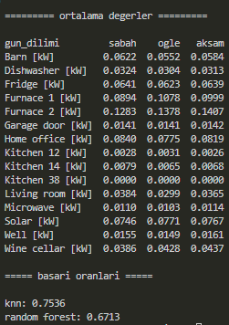
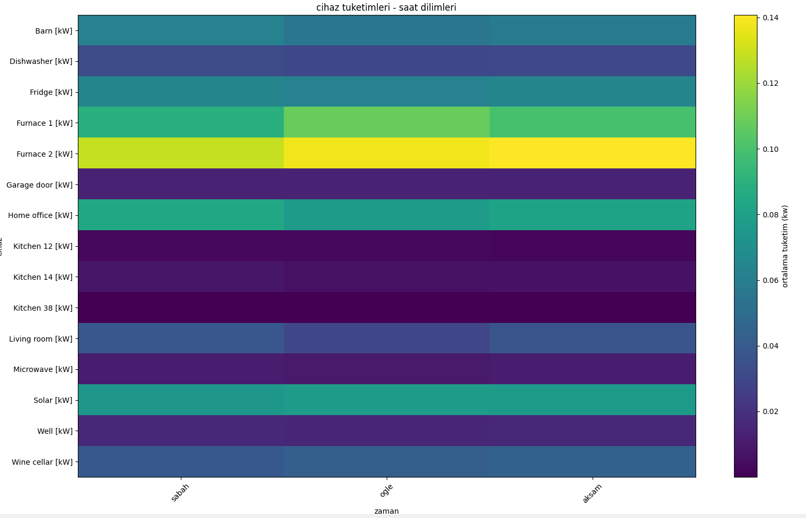

# Akilli_Ev_Veri_Analizi_ML

Akıllı ev cihazlarının tüketim verilerine bakarak günün hangi saatinde olduğunu tahmin eden makine öğrenmesi projesi.

## Nasıl Çalışır

### 1 - Veri okuma ve temizleme 

```
df = pd.read_csv("akilliev.csv", low_memory=False)
# time kolonunu düzelt
df["time"] = pd.to_numeric(df["time"], errors="coerce")
df = df.dropna(subset=["time"])
df["time"] = df["time"].astype("int64")

# tarih formatına çevir
df["time"] = pd.to_datetime(df["time"], unit="s")
df["saat"] = df["time"].dt.hour
```
Datayı yükledim. Zaman kolununu numeric değere çevirdim ve eksik değerleri temizledim ve zamanı tam sayıya çevirdim.
Verideki time kısmını tarih saat formatına donusturdum. ve saat bilgisini çektim.

### 2 - Saatleri Sabah - Öğle - Akşam diye 3 gruba ayırma 
```
def gun_dilimi(saat):
    if 6 <= saat < 12:
        return "sabah"
    elif 12 <= saat < 18:
        return "ogle"
    else:
        return "aksam"

df["gun_dilimi"] = df["saat"].apply(gun_dilimi)
```
Projede pivot olarak saat dilimlerini kullanacağım için günü 3 e böldüm.

### 3 - Pivot Tablosu oluşturma
```
pivot = df.pivot_table(
    index="gun_dilimi",
    values=cols,
    aggfunc="mean"
).T.reindex(columns=["sabah", "ogle", "aksam"])
```
Elimdeki bu veride bulunan satırlar arasında enerji tüketimi hesaplanırken en çok gün içindeki kullanım durumlarının etkilediğini düşünerek veri analizi yaparken pivot seçiminde 'SAAT' kolonuna gittim. 
pivot tablosu oluştururken saat bilgilerinden çektiğim gun dilimlerini kullandımve ```aggfunc= "mean"``` komutu ile baseline(ortalama) olusturdum.


### 4 - Model eğitimi
HEDEF(Tahmin) : Gün dilimleri (Sabah - Öğle - Akşam)
```
y = df["gun_dilimi"].map({"sabah": 0, "ogle": 1, "aksam": 2})
x = df[cols]

# train test ayır
x_train, x_test, y_train, y_test = train_test_split(
    x, y, test_size=0.2, random_state=42, stratify=y
)
```
Model eğitiminde verilerin %20 sini aldım test verisi olarak onların üzerinden gun dilimi pivotundan aldığım değerlere göre modeli eğittim.
Burda modeli eğitirken hedef kısmında gün dilimlerini alma nedenim araştırdığım günün hangi diliminde ne kadar harcanıyor sorusuna cevap ararken en iyi hedefin gün dilimi olacağını düşündüm.
```
# knn modeli
knn = Pipeline([
    ("scaler", StandardScaler()),
    ("model", KNeighborsClassifier(n_neighbors=5, weights="distance", n_jobs=-1))
])

# random forest
rf = RandomForestClassifier(n_estimators=50, random_state=42, n_jobs=-1, max_depth=10)

models = {"knn": knn, "random forest": rf}
```
Knn ve Random Forest modeli eğitim kodu

### 5 - Terminal Çıktı 

Bu çıktıda görüleceği üzere cihazların günün dilimleri içinde ne kadar enerji harcadığı ve model eğitimi sonucunda başarı oranları görüntülenmiştir.

KNN MODELİ : %75

RANDOM FOREST MODELİ : %67

### 6 - Heatmap Grafiği Çıktı

Bu ısı haritası Grafiğinde ise veride bulunan 15 tane cihazın günün saat dilimlerine göre harcadığı enerji miktarını görselleştirdim. Yaptığım analizler doğrultusunda Bazı cihazların gün içinde kullanımının arttığı(Furnace1,Furnace2,Kitchen14,Livingroom) Bazılarının ise saat farketmeksizin devamlı bir şekilde ortalama hep aynı miktarı harcadığını gözlemledim(Fridge,Solar,Kitchen12,Well)


